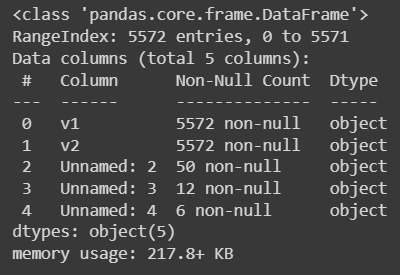
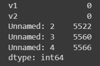

# Implementation-of-SVM-For-Spam-Mail-Detection

## AIM:
To write a program to implement the SVM For Spam Mail Detection.

## Equipments Required:
1. Hardware – PCs
2. Anaconda – Python 3.7 Installation / Jupyter notebook

## Algorithm
1.Start the program.

2.From sklearn library select the feature extraction and import CountVectorizer.

3.Predict the x_test using SVC.

4.Print the accuracy of the SVM Model.

## Program:

Program to implement the SVM For Spam Mail Detection..

Developed by:Kathirvelan.K 

RegisterNumber: 212221220026
```
import chardet
file='/content/spam.csv'
with open(file,'rb') as rawdata:
    result = chardet.detect(rawdata.read(100000))
result

import pandas as pd
data=pd.read_csv("/content/spam.csv",encoding='windows-1252')

data.head()

data.info()

data.isnull().sum()

x=data["v1"].values

y=data["v2"].values

from sklearn.model_selection import train_test_split
x_train,x_test,y_train,y_test=train_test_split(x,y,test_size=0.2,random_state=0)

from sklearn.feature_extraction.text import CountVectorizer
cv = CountVectorizer()

x_train=cv.fit_transform(x_train)
x_test=cv.transform(x_test)

from sklearn.svm import SVC
svc=SVC()
svc.fit(x_train,y_train)
y_pred=svc.predict(x_test)
y_pred

from sklearn import metrics 
accuracy=metrics.accuracy_score(y_test,y_pred)
accuracy
```

## Output:

Result output


data.head()


data.info()



data.isnull().sum()



y_prediction value


Accuracy value


## Result:
Thus the program to implement the SVM For Spam Mail Detection is written and verified using python programming.
